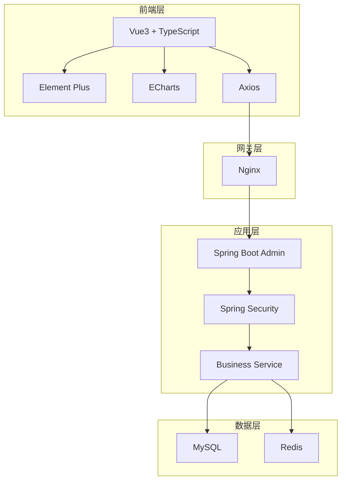
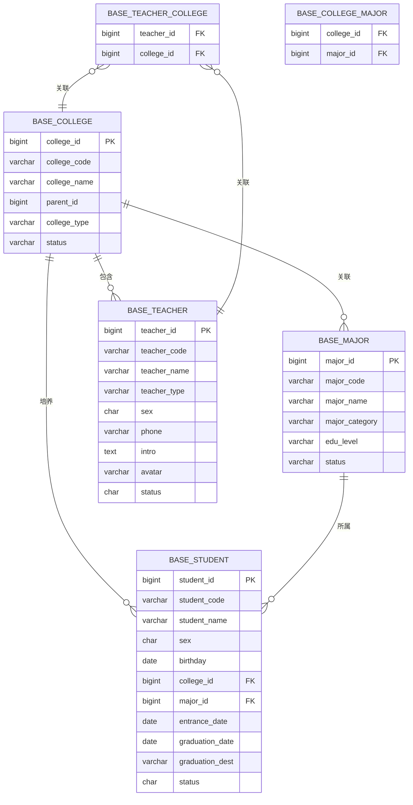

# 三教改革资讯平台 - 需求分析文档

**文档版本**: V1.0
**创建日期**: 2026-04-07
**文档状态**: 初稿

---

## 目录

1. [项目概述](#1-项目概述)
2. [技术栈分析](#2-技术栈分析)
3. [竞品分析](#3-竞品分析)
4. [UI风格设定](#4-ui风格设定)
5. [功能模块详细设计](#5-功能模块详细设计)
6. [数据库设计](#6-数据库设计)
7. [实施计划与建议](#7-实施计划与建议)

---

## 1. 项目概述

### 1.1 项目背景

"三教改革"是指职业教育的"教师、教材、教法"改革，是国家推动职业教育高质量发展的重要举措。为更好地展示和管理三教改革相关资源，需建设一个综合性的资讯管理平台。

### 1.2 项目目标

- **师资展示**: 集中展示企业导师和教师资源，提升师资影响力
- **学生管理**: 系统化管理学生信息，跟踪学生培养全流程
- **基础数据**: 统一管理院校、专业等基础信息，为业务提供数据支撑
- **数据统计**: 提供多维度数据统计与分析功能

### 1.3 核心用户群体


| 用户类型  | 角色描述   | 主要功能           |
| ----- | ------ | -------------- |
| 系统管理员 | 平台运维人员 | 系统配置、用户管理、数据维护 |
| 院校管理员 | 各院校负责人 | 本校师生管理、数据上报    |
| 教师/导师 | 师资人员   | 查看个人信息、发布资讯    |
| 访客    | 外部用户   | 首页浏览、师资展示查看    |


---

## 2. 技术栈分析

### 2.1 前端技术栈


| 技术               | 版本     | 说明                  |
| ---------------- | ------ | ------------------- |
| **Vue**          | 3.5.26 | 渐进式JavaScript框架     |
| **TypeScript**   | 5.9.3  | JavaScript超集，提供类型检查 |
| **Vite**         | 6.4.1  | 新一代前端构建工具           |
| **Vue Router**   | 4.6.4  | Vue官方路由管理器          |
| **Pinia**        | 3.0.4  | Vue状态管理库            |
| **Element Plus** | 2.13.1 | Vue3 UI组件库          |
| **ECharts**      | 5.6.0  | 数据可视化图表库            |
| **Axios**        | 1.13.2 | HTTP请求库             |
| **XLSX**         | 0.18.5 | Excel导入导出支持         |


### 2.2 后端技术栈


| 技术                  | 版本     | 说明              |
| ------------------- | ------ | --------------- |
| **Spring Boot**     | 2.5.15 | Spring Boot核心框架 |
| **Spring Security** | 5.7.14 | 安全认证框架          |
| **MyBatis**         | -      | 持久层框架           |
| **MySQL**           | -      | 关系型数据库          |
| **Redis**           | -      | 缓存数据库           |
| **JWT**             | 0.9.1  | Token认证         |
| **Swagger**         | 3.0.0  | API文档生成         |
| **POI**             | 4.1.2  | Office文档处理      |


### 2.3 技术架构图




---

## 3. 竞品分析

### 3.1 主流竞品概览


| 产品      | 厂商   | 定位     | 特点          |
| ------- | ---- | ------ | ----------- |
| 乔拓云教育系统 | 乔拓云  | 综合管理平台 | 全链路闭环、多端适配  |
| 校宝在线    | 校宝网络 | 培训机构管理 | 行业头部、AI功能完善 |
| 小麦助教    | 小麦科技 | 教培机构   | 家校互动优秀      |
| 十克助教    | 十克科技 | 中小机构   | 轻量化、性价比高    |


### 3.2 竞品功能对比矩阵


| 功能模块      | 乔拓云  | 校宝  | 小麦助教 | 十克助教 |
| --------- | ---- | --- | ---- | ---- |
| 师资管理      | 完善   | 完善  | 一般   | 基础   |
| 学生管理      | 完善   | 完善  | 完善   | 完善   |
| 院校管理      | 支持   | 支持  | 有限   | 有限   |
| 数据统计      | 丰富   | 丰富  | 一般   | 基础   |
| Excel导入导出 | 支持   | 支持  | 支持   | 支持   |
| 移动端       | 全端支持 | 支持  | 支持   | 有限   |


### 3.3 差异化分析

**本平台优势**:

- 针对"三教改革"主题深度定制
- 聚焦师资与学生两大核心资源
- 强调资讯展示与数据统计

**需改进点**:

- 初期功能相对精简
- 品牌知名度待提升

---

## 4. UI风格设定

### 4.1 设计理念

以**简洁、专业、活力**为核心，打造适合教育行业的视觉体验。

### 4.2 色彩方案


| 色彩类型             | 色值                                | 用途          |
| ---------------- | --------------------------------- | ----------- |
| **主色(Primary)**  | `#409EFF`                         | 品牌色、主要按钮、链接 |
| **辅色(Success)**  | `#67C23A`                         | 成功状态、正向指标   |
| **警告色(Warning)** | `#E6A23C`                         | 警告提示        |
| **危险色(Danger)**  | `#F56C6C`                         | 错误、删除操作     |
| **信息色(Info)**    | `#909399`                         | 次要信息、辅助文字   |
| **背景色**          | `#FFFFFF` / `#F5F7FA`             | 页面背景、卡片背景   |
| **文字色**          | `#303133` / `#606266` / `#909399` | 标题/正文/辅助文字  |


### 4.3 字体规范


| 用途   | 字体                 | 字号        |
| ---- | ------------------ | --------- |
| 页面标题 | 思源黑体 / PingFang SC | 20px-24px |
| 卡片标题 | 思源黑体 / PingFang SC | 16px-18px |
| 正文内容 | 思源黑体 / PingFang SC | 14px      |
| 辅助说明 | 思源黑体 / PingFang SC | 12px      |


### 4.4 布局规范

- **内容区域**: 最大宽度 1200px，居中显示
- **卡片间距**: 16px
- **内边距**: 页面级 24px，卡片级 16px-20px
- **圆角**: 卡片 8px，按钮 4px

### 4.5 组件风格

基于 Element Plus 组件库定制:

- 保持组件风格统一
- 表单验证提示明确
- 表格支持分页、筛选、排序
- 弹窗交互流畅

---

## 5. 功能模块详细设计

### 5.1 首页模块

#### 5.1.1 师资资源展示

**功能描述**: 展示教师姓名、照片及简介

**展示方式**:

- 卡片式布局展示教师列表
- 照片 + 姓名 + 简介摘要
- 支持按类型筛选（企业导师/教师）
- 支持关键词搜索

**展示字段**:


| 字段  | 说明      | 显示位置  |
| --- | ------- | ----- |
| 照片  | 教师个人照片  | 卡片头部  |
| 姓名  | 教师姓名    | 照片下方  |
| 类型  | 企业导师/教师 | 姓名旁标签 |
| 简介  | 个人简介摘要  | 卡片底部  |


#### 5.1.2 学生情况展示

**功能描述**: 表格式展示学生统计数据和名单

**展示内容**:


| 统计项   | 说明       |
| ----- | -------- |
| 学生总人数 | 在籍学生总数   |
| 已毕业人数 | 历史毕业生总数  |
| 各专业人数 | 按专业维度统计  |
| 学生名单  | 可搜索的分页列表 |


**展示表格字段**:


| 字段  | 说明    |
| --- | ----- |
| 姓名  | 学生姓名  |
| 性别  | 男/女   |
| 院校  | 所属院校  |
| 专业  | 所学专业  |
| 年级  | 入学年份  |
| 状态  | 在读/毕业 |


### 5.2 教师管理模块

#### 5.2.1 模块概述

管理企业导师和教师信息，支持增删改查和批量导入。

#### 5.2.2 教师分类


| 类型   | 编码           | 说明        |
| ---- | ------------ | --------- |
| 企业导师 | `enterprise` | 来自合作企业的导师 |
| 教师   | `teacher`    | 院校正式教师    |


#### 5.2.3 功能清单


| 功能   | 说明         |
| ---- | ---------- |
| 教师列表 | 分页展示、筛选、搜索 |
| 新增教师 | 录入教师信息     |
| 编辑教师 | 修改教师信息     |
| 删除教师 | 逻辑删除教师     |
| 批量导入 | Excel批量导入  |
| 批量导出 | Excel导出    |
| 状态管理 | 启用/禁用教师账号  |


#### 5.2.4 教师信息字段


| 字段名  | 字段类型         | 必填  | 说明                 |
| ---- | ------------ | --- | ------------------ |
| 教师工号 | varchar(20)  | 是   | 唯一标识               |
| 教师姓名 | varchar(50)  | 是   | -                  |
| 教师类型 | varchar(20)  | 是   | enterprise/teacher |
| 性别   | char(1)      | 否   | 0男 1女              |
| 手机号码 | varchar(11)  | 否   | -                  |
| 邮箱   | varchar(100) | 否   | -                  |
| 个人简介 | text         | 否   | 富文本                |
| 个人照片 | varchar(255) | 否   | 照片URL              |
| 所属院校 | bigint       | 否   | 关联院校               |
| 状态   | char(1)      | 是   | 0正常 1停用            |
| 排序号  | int          | 否   | 显示顺序               |


### 5.3 学生管理模块

#### 5.3.1 模块概述

管理系统学生信息，支持从入学到毕业的全流程管理。

#### 5.3.2 功能清单


| 功能   | 说明         |
| ---- | ---------- |
| 学生列表 | 分页展示、筛选、搜索 |
| 新增学生 | 录入学生信息     |
| 编辑学生 | 修改学生信息     |
| 删除学生 | 逻辑删除学生     |
| 批量导入 | Excel批量导入  |
| 批量导出 | Excel导出    |
| 毕业管理 | 批量设置为毕业状态  |
| 状态管理 | 在读/毕业/肄业   |


#### 5.3.3 学生信息字段


| 字段名  | 字段类型         | 必填  | 说明          |
| ---- | ------------ | --- | ----------- |
| 学号   | varchar(20)  | 是   | 唯一标识        |
| 姓名   | varchar(50)  | 是   | -           |
| 性别   | char(1)      | 是   | 0男 1女       |
| 出生日期 | date         | 是   | -           |
| 年龄   | int          | 否   | 自动计算        |
| 民族   | varchar(20)  | 否   | -           |
| 身份证号 | varchar(18)  | 否   | -           |
| 手机号码 | varchar(11)  | 否   | -           |
| 所属院校 | bigint       | 是   | 关联院校        |
| 所学专业 | bigint       | 是   | 关联专业        |
| 年级   | varchar(20)  | 是   | 如:2024级     |
| 班级   | varchar(50)  | 否   | -           |
| 入校时间 | date         | 是   | -           |
| 毕业时间 | date         | 否   | -           |
| 毕业去向 | varchar(255) | 否   | 就业/升学/其他    |
| 状态   | char(1)      | 是   | 0在读 1毕业 2肄业 |


### 5.4 基础信息模块

#### 5.4.1 院校信息管理

**功能清单**:


| 功能   | 说明       |
| ---- | -------- |
| 院校列表 | 树形结构展示   |
| 新增院校 | 支持多级院校   |
| 编辑院校 | 修改院校信息   |
| 删除院校 | 需确认无关联数据 |
| 排序调整 | 调整显示顺序   |


**院校信息字段**:


| 字段名  | 字段类型         | 必填  | 说明       |
| ---- | ------------ | --- | -------- |
| 院校编码 | varchar(20)  | 是   | 唯一标识     |
| 院校名称 | varchar(100) | 是   | -        |
| 院校简称 | varchar(50)  | 否   | -        |
| 父级院校 | bigint       | 否   | 树形结构     |
| 院校类型 | varchar(20)  | 否   | 本科/专科/中职 |
| 所在地区 | varchar(100) | 否   | -        |
| 详细地址 | varchar(255) | 否   | -        |
| 联系人  | varchar(50)  | 否   | -        |
| 联系电话 | varchar(20)  | 否   | -        |
| 院校简介 | text         | 否   | -        |
| 显示顺序 | int          | 否   | -        |
| 状态   | char(1)      | 是   | 0正常 1停用  |


#### 5.4.2 专业信息管理

**功能清单**:


| 功能   | 说明        |
| ---- | --------- |
| 专业列表 | 分页展示      |
| 新增专业 | 录入专业信息    |
| 编辑专业 | 修改专业信息    |
| 删除专业 | 需确认无关联数据  |
| 批量导入 | Excel批量导入 |
| 关联院校 | 设置专业所属院校  |


**专业信息字段**:


| 字段名  | 字段类型         | 必填  | 说明         |
| ---- | ------------ | --- | ---------- |
| 专业编码 | varchar(20)  | 是   | 唯一标识       |
| 专业名称 | varchar(100) | 是   | -          |
| 专业简称 | varchar(50)  | 否   | -          |
| 专业类别 | varchar(20)  | 否   | 如:计算机类、机械类 |
| 学制   | varchar(20)  | 否   | 如:3年、4年    |
| 学历层次 | varchar(20)  | 否   | 中职/专科/本科   |
| 专业简介 | text         | 否   | -          |
| 状态   | char(1)      | 是   | 0正常 1停用    |


---

## 6. 数据库设计

### 6.1 ER图




### 6.2 数据表结构

#### 6.2.1 院校信息表 (base_college)

```sql
-- ----------------------------
-- 1、院校信息表
-- ----------------------------
drop table if exists base_college;
create table base_college (
  college_id        bigint(20)      not null auto_increment    comment '院校ID',
  parent_id         bigint(20)      default 0                  comment '父院校ID',
  ancestors         varchar(50)     default ''                  comment '祖级列表',
  college_code      varchar(20)     default ''                  comment '院校编码',
  college_name      varchar(100)    not null                    comment '院校名称',
  college_short_name varchar(50)    default null               comment '院校简称',
  college_type      varchar(20)     default null               comment '院校类型',
  area              varchar(100)    default null               comment '所在地区',
  address           varchar(255)    default null               comment '详细地址',
  contact           varchar(50)     default null               comment '联系人',
  phone             varchar(20)     default null               comment '联系电话',
  intro             text                                       comment '院校简介',
  order_num         int(4)          default 0                  comment '显示顺序',
  status            char(1)         default '0'                comment '院校状态（0正常 1停用）',
  del_flag          char(1)         default '0'                comment '删除标志（0代表存在 2代表删除）',
  create_by         varchar(64)     default ''                 comment '创建者',
  create_time       datetime                                   comment '创建时间',
  update_by         varchar(64)     default ''                 comment '更新者',
  update_time       datetime                                   comment '更新时间',
  remark            varchar(500)    default null               comment '备注',
  primary key (college_id)
) engine=innodb auto_increment=100 comment = '院校信息表';

-- 初始化数据
insert into base_college values(1, 0, '0', 'GDJC', '广东交通职业技术学院', '广交院', '专科', '广东省广州市', '广州市天河区', '张老师', '020-12345678', '国家示范性高职院校', 1, '0', '0', 'admin', sysdate(), '', null, '');
```

#### 6.2.2 专业信息表 (base_major)

```sql
-- ----------------------------
-- 2、专业信息表
-- ----------------------------
drop table if exists base_major;
create table base_major (
  major_id          bigint(20)      not null auto_increment    comment '专业ID',
  major_code        varchar(20)     not null                    comment '专业编码',
  major_name        varchar(100)    not null                    comment '专业名称',
  major_short_name  varchar(50)     default null               comment '专业简称',
  major_category    varchar(50)     default null               comment '专业类别',
  duration          varchar(20)     default null               comment '学制',
  edu_level         varchar(20)     default null               comment '学历层次',
  intro             text                                       comment '专业简介',
  status            char(1)         default '0'                comment '专业状态（0正常 1停用）',
  del_flag          char(1)         default '0'                comment '删除标志（0代表存在 2代表删除）',
  create_by         varchar(64)     default ''                 comment '创建者',
  create_time       datetime                                   comment '创建时间',
  update_by         varchar(64)     default ''                 comment '更新者',
  update_time       datetime                                   comment '更新时间',
  remark            varchar(500)    default null               comment '备注',
  primary key (major_id),
  unique key uk_major_code (major_code)
) engine=innodb auto_increment=100 comment = '专业信息表';

-- 初始化数据
insert into base_major values(1, 'JSJ01', '计算机应用技术', '计应', '计算机类', '3年', '专科', '培养掌握计算机应用技术的高级技能人才', '0', '0', 'admin', sysdate(), '', null, '');
insert into base_major values(2, 'SZJJ01', '数字媒体技术', '数媒', '计算机类', '3年', '专科', '培养数字媒体设计与开发人才', '0', '0', 'admin', sysdate(), '', null, '');
```

#### 6.2.3 教师信息表 (base_teacher)

```sql
-- ----------------------------
-- 3、教师信息表
-- ----------------------------
drop table if exists base_teacher;
create table base_teacher (
  teacher_id        bigint(20)      not null auto_increment    comment '教师ID',
  teacher_code      varchar(20)     not null                    comment '教师工号',
  teacher_name      varchar(50)     not null                    comment '教师姓名',
  teacher_type      varchar(20)     not null                    comment '教师类型（enterprise企业导师 teacher教师）',
  sex               char(1)         default '0'                comment '性别（0男 1女）',
  phone             varchar(11)     default null               comment '手机号码',
  email             varchar(100)    default null               comment '邮箱',
  avatar            varchar(255)    default null               comment '个人照片',
  intro             text                                       comment '个人简介',
  college_id        bigint(20)      default null               comment '所属院校',
  sort              int(4)          default 0                  comment '显示顺序',
  status            char(1)         default '0'                comment '状态（0正常 1停用）',
  del_flag          char(1)         default '0'                comment '删除标志（0代表存在 2代表删除）',
  create_by         varchar(64)     default ''                 comment '创建者',
  create_time       datetime                                   comment '创建时间',
  update_by         varchar(64)     default ''                 comment '更新者',
  update_time       datetime                                   comment '更新时间',
  remark            varchar(500)    default null               comment '备注',
  primary key (teacher_id),
  unique key uk_teacher_code (teacher_code),
  key idx_college_id (college_id)
) engine=innodb auto_increment=100 comment = '教师信息表';

-- 初始化数据
insert into base_teacher values(1, 'T2024001', '张三', 'teacher', '0', '13800138001', 'zhangsan@example.com', '/avatar/teacher1.jpg', '计算机专业骨干教师，从事教育工作10年', 1, 1, '0', '0', 'admin', sysdate(), '', null, '');
insert into base_teacher values(2, 'T2024002', '李四', 'enterprise', '1', '13800138002', 'lisi@company.com', '/avatar/teacher2.jpg', '企业技术专家，阿里巴巴高级工程师', 1, 2, '0', '0', 'admin', sysdate(), '', null, '');
```

#### 6.2.4 学生信息表 (base_student)

```sql
-- ----------------------------
-- 4、学生信息表
-- ----------------------------
drop table if exists base_student;
create table base_student (
  student_id        bigint(20)      not null auto_increment    comment '学生ID',
  student_code      varchar(20)     not null                    comment '学号',
  student_name      varchar(50)     not null                    comment '学生姓名',
  sex               char(1)         not null                    comment '性别（0男 1女）',
  birthday          date            default null               comment '出生日期',
  nation            varchar(20)     default null               comment '民族',
  id_card           varchar(18)     default null               comment '身份证号',
  phone             varchar(11)     default null               comment '手机号码',
  college_id        bigint(20)      not null                   comment '所属院校',
  major_id          bigint(20)      not null                   comment '所学专业',
  grade             varchar(20)     default null               comment '年级',
  class_name        varchar(50)     default null               comment '班级',
  entrance_date     date            default null               comment '入校时间',
  graduation_date   date            default null               comment '毕业时间',
  graduation_dest   varchar(255)   default null               comment '毕业去向',
  status            char(1)         default '0'                comment '状态（0在读 1毕业 2肄业）',
  del_flag          char(1)         default '0'                comment '删除标志（0代表存在 2代表删除）',
  create_by         varchar(64)     default ''                 comment '创建者',
  create_time       datetime                                   comment '创建时间',
  update_by         varchar(64)     default ''                 comment '更新者',
  update_time       datetime                                   comment '更新时间',
  remark            varchar(500)    default null               comment '备注',
  primary key (student_id),
  unique key uk_student_code (student_code),
  key idx_college_id (college_id),
  key idx_major_id (major_id)
) engine=innodb auto_increment=100 comment = '学生信息表';

-- 初始化数据
insert into base_student values(1, 'S20240001', '王小明', '0', '2005-03-15', '汉族', '440106200503151234', '13900139001', 1, 1, '2024级', '24计应1班', '2024-09-01', null, null, '0', '0', 'admin', sysdate(), '', null, '');
insert into base_student values(2, 'S20230001', '李小红', '1', '2004-07-20', '汉族', '440106200407201234', '13900139002', 1, 2, '2023级', '23数媒1班', '2023-09-01', '2026-06-30', '升学-专升本', '1', '0', 'admin', sysdate(), '', null, '');
```

#### 6.2.5 教师与院校关联表 (base_teacher_college)

```sql
-- ----------------------------
-- 5、教师与院校关联表
-- ----------------------------
drop table if exists base_teacher_college;
create table base_teacher_college (
  teacher_id        bigint(20)      not null                   comment '教师ID',
  college_id        bigint(20)      not null                   comment '院校ID',
  primary key (teacher_id, college_id)
) engine=innodb comment = '教师与院校关联表';
```

#### 6.2.6 院校与专业关联表 (base_college_major)

```sql
-- ----------------------------
-- 6、院校与专业关联表
-- ----------------------------
drop table if exists base_college_major;
create table base_college_major (
  college_id        bigint(20)      not null                   comment '院校ID',
  major_id          bigint(20)      not null                   comment '专业ID',
  primary key (college_id, major_id)
) engine=innodb comment = '院校与专业关联表';

-- 初始化关联数据
insert into base_college_major values(1, 1);
insert into base_college_major values(1, 2);
```

### 6.3 字典数据初始化

```sql
-- 字典类型初始化
insert into sys_dict_type values(100, '教师类型', 'teacher_type', '0', 'admin', sysdate(), '', null, '教师类型列表');
insert into sys_dict_type values(101, '院校类型', 'college_type', '0', 'admin', sysdate(), '', null, '院校类型列表');
insert into sys_dict_type values(102, '学历层次', 'edu_level', '0', 'admin', sysdate(), '', null, '学历层次列表');
insert into sys_dict_type values(103, '学生状态', 'student_status', '0', 'admin', sysdate(), '', null, '学生状态列表');
insert into sys_dict_type values(104, '毕业去向', 'graduation_dest', '0', 'admin', sysdate(), '', null, '毕业去向列表');

-- 字典数据初始化
insert into sys_dict_data values(1001, 1, '企业导师', 'enterprise', 'teacher_type', '', 'warning', 'Y', '0', 'admin', sysdate(), '', null, '来自合作企业的导师');
insert into sys_dict_data values(1002, 2, '教师', 'teacher', 'teacher_type', '', 'primary', 'N', '0', 'admin', sysdate(), '', null, '院校正式教师');

insert into sys_dict_data values(1011, 1, '本科', 'undergraduate', 'college_type', '', '', 'Y', '0', 'admin', sysdate(), '', null, '');
insert into sys_dict_data values(1012, 2, '专科', 'vocational', 'college_type', '', '', 'N', '0', 'admin', sysdate(), '', null, '');
insert into sys_dict_data values(1013, 3, '中职', 'secondary', 'college_type', '', '', 'N', '0', 'admin', sysdate(), '', null, '');

insert into sys_dict_data values(1021, 1, '中职', 'secondary', 'edu_level', '', '', 'Y', '0', 'admin', sysdate(), '', null, '');
insert into sys_dict_data values(1022, 2, '专科', 'associate', 'edu_level', '', '', 'N', '0', 'admin', sysdate(), '', null, '');
insert into sys_dict_data values(1023, 3, '本科', 'undergraduate', 'edu_level', '', '', 'N', '0', 'admin', sysdate(), '', null, '');

insert into sys_dict_data values(1031, 1, '在读', '0', 'student_status', '', 'primary', 'Y', '0', 'admin', sysdate(), '', null, '');
insert into sys_dict_data values(1032, 2, '毕业', '1', 'student_status', '', 'success', 'N', '0', 'admin', sysdate(), '', null, '');
insert into sys_dict_data values(1033, 3, '肄业', '2', 'student_status', '', 'warning', 'N', '0', 'admin', sysdate(), '', null, '');

insert into sys_dict_data values(1041, 1, '就业', 'employment', 'graduation_dest', '', 'success', 'Y', '0', 'admin', sysdate(), '', null, '');
insert into sys_dict_data values(1042, 2, '升学', 'further_study', 'graduation_dest', '', 'primary', 'N', '0', 'admin', sysdate(), '', null, '');
insert into sys_dict_data values(1043, 3, '创业', 'entrepreneurship', 'graduation_dest', '', 'warning', 'N', '0', 'admin', sysdate(), '', null, '');
insert into sys_dict_data values(1044, 4, '其他', 'other', 'graduation_dest', '', 'info', 'N', '0', 'admin', sysdate(), '', null, '');
```

---

## 7. 实施计划与建议

### 7.1 开发阶段规划


| 阶段       | 内容           | 建议工期  |
| -------- | ------------ | ----- |
| **第一阶段** | 基础框架搭建、数据库设计 | 3-5天  |
| **第二阶段** | 院校管理、专业管理模块  | 5-7天  |
| **第三阶段** | 教师管理模块       | 5-7天  |
| **第四阶段** | 学生管理模块       | 7-10天 |
| **第五阶段** | 首页展示、数据统计    | 5-7天  |
| **第六阶段** | 测试与优化        | 5-7天  |


**预计总工期**: 30-43天

### 7.2 开发优先级建议

1. **P0 (必须)**: 院校管理、专业管理、教师管理、学生管理
2. **P1 (重要)**: 首页展示、Excel导入导出
3. **P2 (增强)**: 数据统计、图表可视化
4. **P3 (优化)**: 移动端适配、UI优化

### 7.3 技术建议

- **前后端分离**: 保持现有的分离架构，便于维护
- **组件复用**: 充分利用现有组件，减少重复开发
- **权限控制**: 基于现有Spring Security框架扩展
- **数据校验**: 前端+后端双重校验，确保数据质量
- **日志记录**: 关键操作需记录操作日志

### 7.4 数据迁移建议

- 制定数据标准格式模板
- 历史数据分批导入
- 建立数据校验机制

---

## 附录

### A. 参考资料

- 若依框架官方文档: [http://doc.ruoyi.vip/](http://doc.ruoyi.vip/)
- Element Plus组件库: [https://element-plus.org/](https://element-plus.org/)
- Vue3官方文档: [https://vuejs.org/](https://vuejs.org/)

### B. 修改记录


| 版本   | 日期         | 修改内容 | 作者     |
| ---- | ---------- | ---- | ------ |
| V1.0 | 2026-04-07 | 初稿完成 | Claude |


---

*文档结束*